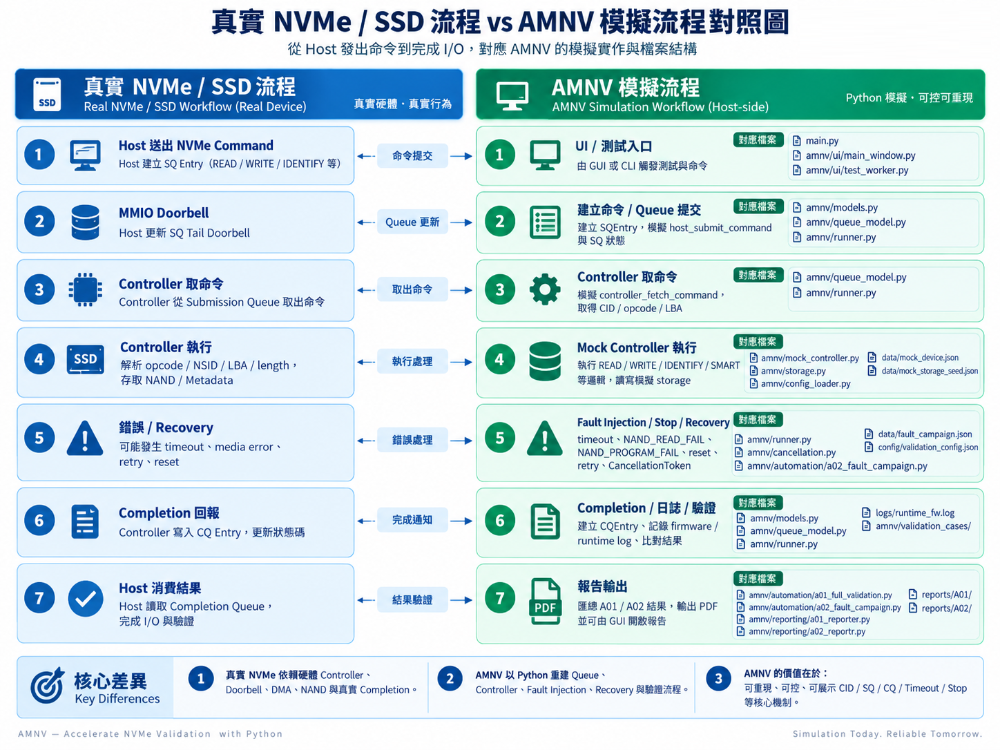
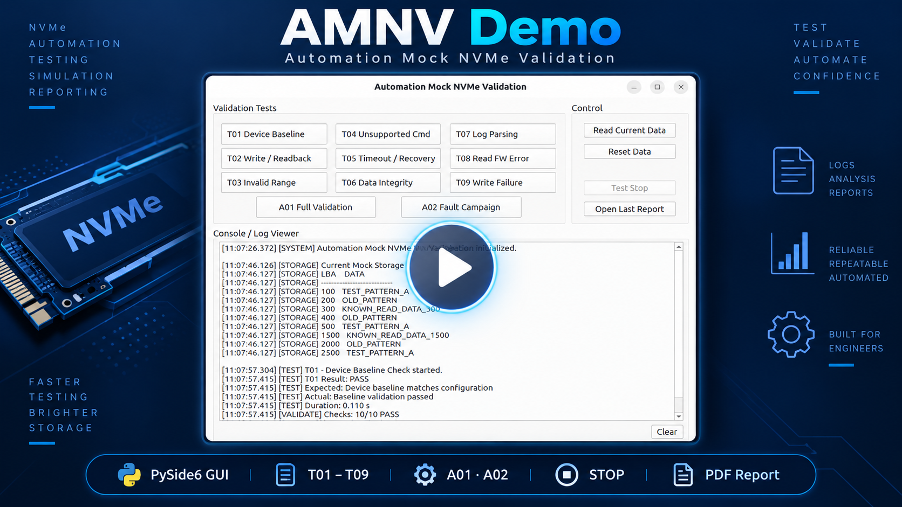
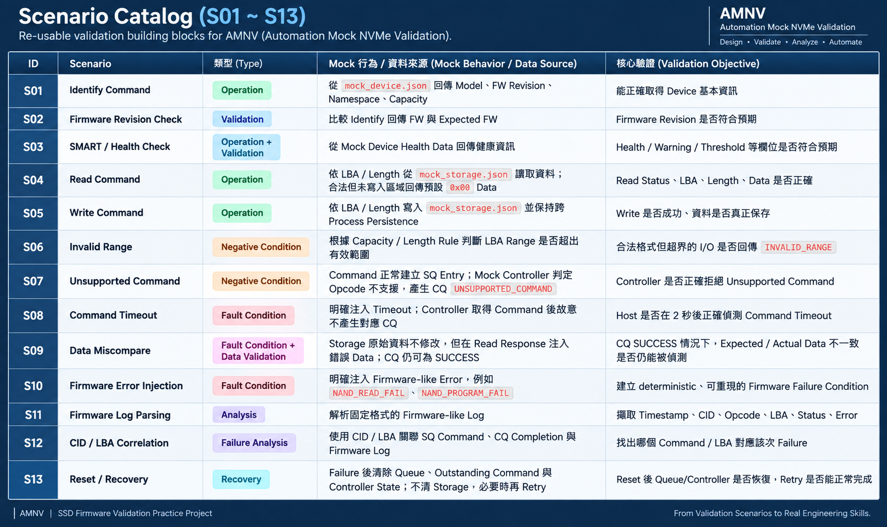
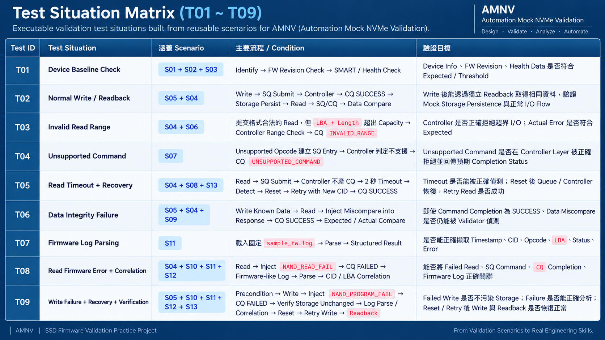
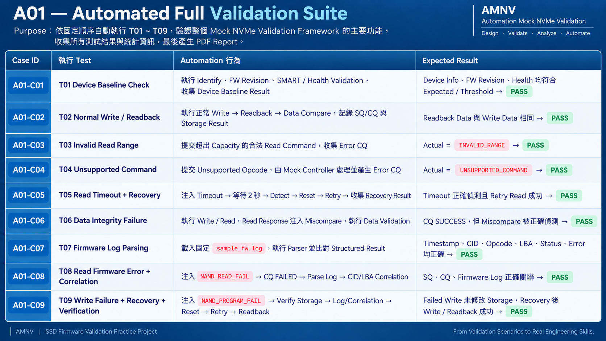
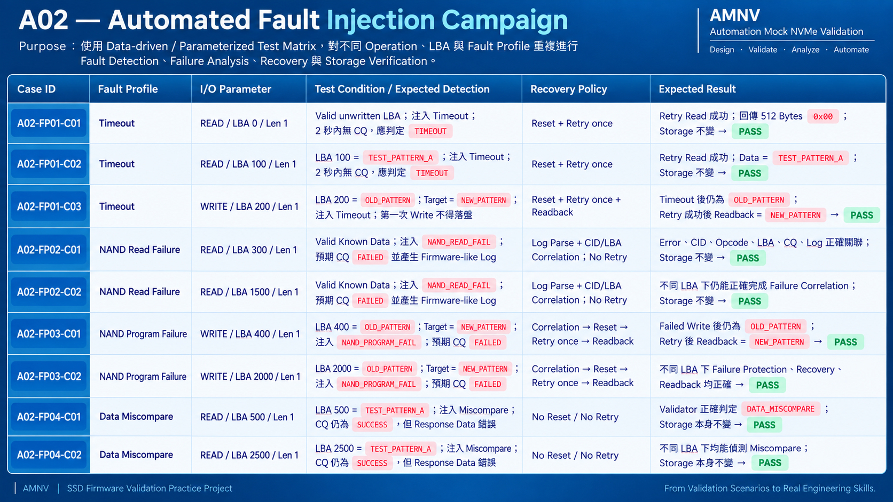
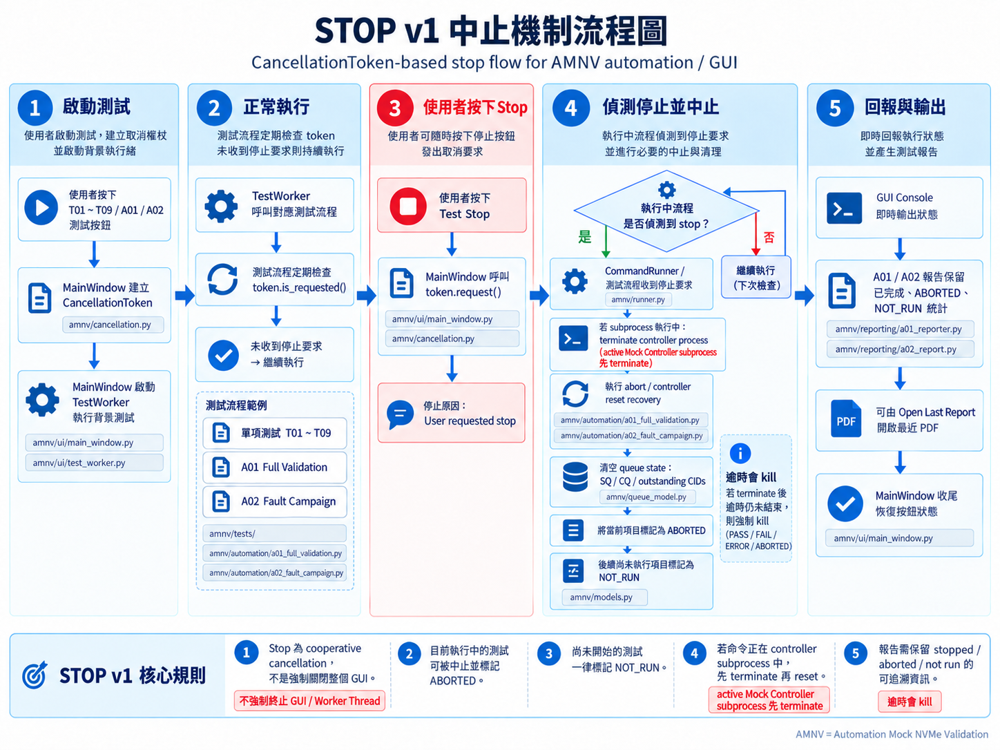
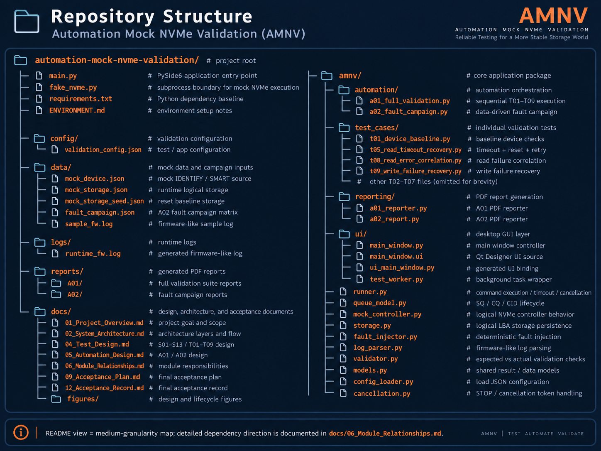

# Automation Mock NVMe Validation (AMNV)

> **Host-side logical NVMe validation framework for SSD firmware validation practice.**  
> 以 SSD / NVMe Validation 工作流程為背景，從 **Scenario Design → Test Implementation → Automation → Fault Injection → Recovery → Evidence Reporting** 完整實作一套可控制、可重現的驗證專案。

AMNV 的重點不是模擬一顆真正的 SSD，而是展示如何把一個中等規模的 validation requirement 拆成 **可重用 Scenario、可執行 Test、Automation Suite、Fault Campaign、Recovery Flow、GUI 與 PDF Evidence**，並完成最終驗收。

<p align="center">
  
</p>

<p align="center">
  <a href="#demo">Demo</a> ·
  <a href="#overview--validation-design">Validation Design</a> ·
  <a href="#system-architecture">Architecture</a> ·
  <a href="#quick-start">Quick Start</a> ·
  <a href="#documentation">Documentation</a>
</p>

---

## Demo

<p align="center">
  <a href="https://youtu.be/TXtwUGfOfhM">
    
  </a>
</p>

<p align="center">
  <strong>▶ Click the preview to watch the full AMNV demo on YouTube.</strong>
</p>

Demo 內容包含：

- T01～T09 Individual Validation
- A01 Full Validation Suite
- A02 Fault Injection Campaign
- Mock Storage View / Reset
- STOP / Cancellation
- Console / Log Viewer
- PDF Report Generation / Open Last Report

---

## Overview & Validation Design

AMNV 採用由小到大的 validation design：

```text
S01 ~ S13
Reusable Validation Scenarios
        ↓
T01 ~ T09
Executable Test Situations
        ↓
A01
Sequential Full Validation
        +
A02
Data-driven Fault Campaign
```

也就是先定義可重用的 **Scenario Catalog**，再組成實際執行的 **Test Situation**，最後由 Automation Layer 統一進行 regression 與 fault campaign。

### Scenario Catalog — S01 ~ S13

S01～S13 定義 AMNV 中可重用的 validation building blocks，涵蓋正常操作、negative condition、fault condition、log analysis、correlation 與 recovery。

<p align="center">
  
</p>

### Test Situation Matrix — T01 ~ T09

T01～T09 將 Scenario 組合成實際驗證情境，包含正常 I/O、Negative Test、Timeout、Data Miscompare、Firmware Error Correlation 與 Recovery。

<p align="center">
  
</p>

### A01 — Automated Full Validation Suite

A01 依固定順序執行 T01～T09，負責 sequential regression、result aggregation 與 PDF evidence generation。

<p align="center">
  
</p>

### A02 — Automated Fault Injection Campaign

A02 使用 `data/fault_campaign.json` 定義 parameterized fault cases，針對不同 Operation、LBA 與 Fault Profile 重複執行 Fault Detection、Failure Analysis、Recovery 與 Storage Verification。

<p align="center">
  
</p>

Final Acceptance 已完成。  
詳細驗收結果與代表性 PDF Evidence：

- [`docs/12_Acceptance_Record.md`](docs/12_Acceptance_Record.md)
- [`docs/A01_PASS.pdf`](docs/A01_PASS.pdf)
- [`docs/A01_STOPPED.pdf`](docs/A01_STOPPED.pdf)
- [`docs/A02_PASS.pdf`](docs/A02_PASS.pdf)
- [`docs/A02_STOPPED.pdf`](docs/A02_STOPPED.pdf)

---

## Scope Boundary

AMNV 模擬的是 **Host-side logical validation behavior**，重點在 validation architecture、failure handling 與 automation，而不是 hardware-level NVMe emulation。

### AMNV Models

- Logical NVMe command execution
- IDENTIFY / SMART-style baseline behavior
- READ / WRITE logical data flow
- SQ / CQ logical state
- CID allocation / progression
- Outstanding command tracking
- Completion status
- Logical LBA storage persistence
- Timeout detection
- Deterministic fault injection
- Controller reset / recovery
- Retry verification
- Firmware-style runtime log
- CID / LBA correlation
- Automation orchestration
- Cooperative cancellation
- Structured result aggregation
- PDF evidence generation

### AMNV Does Not Model

- Physical PCIe Link / PCIe TLP
- Real MMIO Doorbell register behavior
- DMA
- Physical PRP / SGL data transfer
- Real NVMe Controller hardware
- NAND Flash timing / flash physics
- FTL (Flash Translation Layer)
- GC (Garbage Collection)
- Wear Leveling
- ECC (Error Correction Code)
- Real SSD firmware
- Performance / latency benchmarking
- NVMe compliance certification
- Power-cycle / hardware-level recovery validation

> AMNV 的目的不是取代實體 SSD Validation Platform，而是建立一個 **controllable and repeatable logical validation environment**，用來實作完整的 Test Design、Fault Injection、Failure Analysis、Recovery 與 Automation Workflow。

---

## System Architecture

AMNV 將 UI、Automation、Test Logic、Command Execution、Queue State、Controller Behavior、Storage 與 Reporting 分離，避免 validation logic 被 GUI 或特定 automation flow 綁死。

```text
GUI / Presentation
        ↓
Individual Tests / Automation
        ↓
Runner / Validator / Log Parser
        ↓
Queue / Fault / Cancellation
        ↓
Mock Controller
        ↓
Mock Storage / Runtime Log
```

<p align="center">
  
</p>

主要 dependency direction：

- `main.py`：Application Entry Point
- `amnv/ui/`：PySide6 desktop validation frontend
- `amnv/test_cases/`：T01～T09 individual validation logic
- `amnv/automation/`：A01 / A02 orchestration
- `amnv/runner.py`：Host-side command lifecycle coordinator
- `amnv/queue_model.py`：SQ / CQ / CID logical state owner
- `fake_nvme.py`：Host / Controller subprocess boundary
- `amnv/mock_controller.py`：Mock NVMe command behavior
- `amnv/storage.py`：Logical LBA data state
- `amnv/fault_injector.py`：Deterministic fault behavior
- `amnv/log_parser.py`：Firmware-style log parsing
- `amnv/reporting/`：PDF evidence generation

詳細 dependency direction 與 responsibility ownership：  
[`docs/06_Module_Relationships.md`](docs/06_Module_Relationships.md)

---

## Key Features

### Logical Command & Queue Model
模擬 IDENTIFY、SMART、READ、WRITE 與 Error Completion，並追蹤 SQ / CQ、CID、Outstanding Command 與 Reset 後的 logical state。

### Persistent Mock Storage
以 logical LBA storage 驗證 Write → independent Readback、跨 process persistence，以及 failed write 不污染原資料。

### Deterministic Validation
所有測試以 Expected / Actual、Completion Status、Threshold、Data Compare 等 check 形成明確 validation result。

### Automation Architecture
A01 將 T01～T09 組成 sequential regression；A02 則以 data-driven campaign 執行多組 deterministic fault cases。

### Failure Analysis
將 Host-side Command Result、CQ Completion 與 Firmware-style Log 透過 CID / LBA 進行 correlation。

### Evidence-driven Workflow
GUI Console、structured result、runtime log 與 PDF report 共同形成可追蹤的 validation evidence。

---

## Fault Injection

AMNV 提供四種 deterministic fault profile：

> **`timeout`**  
> Controller does not produce CQ before host timeout.  
> **Detection → Reset → Retry**

> **`NAND_READ_FAIL`**  
> READ returns a FAILED Completion and firmware-like error evidence.  
> **Error Detection → Log Parse → CID/LBA Correlation**

> **`NAND_PROGRAM_FAIL`**  
> WRITE fails before storage update.  
> **Old-data Protection → Failure Analysis → Reset → Retry → Readback**

> **`miscompare`**  
> CQ remains `SUCCESS`, but returned data is intentionally corrupted.  
> **Expected / Actual Compare → `DATA_MISCOMPARE`**

> **CQ SUCCESS does not guarantee data integrity.**

Fault behavior is implemented by `amnv/fault_injector.py` and consumed through the controller execution path rather than being faked directly inside individual tests.

---

## STOP & Recovery

STOP 與 Timeout 在 AMNV 中具有不同語意：

```text
Timeout
= Command exceeded the allowed execution time.

STOP
= Explicit user cancellation.
```

STOP v1 採 cooperative cancellation：

```text
User STOP
    ↓
CancellationToken
    ↓
Active subprocess termination
    ↓
Logical cleanup / reset
    ↓
Active Unit   → ABORTED
Remaining     → NOT_RUN
Suite         → STOPPED
```

<p align="center">
  
</p>

相關設計文件：

- [`docs/10_Command_and_Recovery_Lifecycle.md`](docs/10_Command_and_Recovery_Lifecycle.md)
- [`docs/11_STOP_v1_Design.md`](docs/11_STOP_v1_Design.md)

---

## Quick Start

### Requirements

- Python 3.12 recommended
- Linux / Ubuntu environment recommended

### Clone and Run

```bash
git clone https://github.com/hugo1141210/automation-mock-nvme-validation.git
cd automation-mock-nvme-validation

python3 -m venv .venv
source .venv/bin/activate

python -m pip install --upgrade pip
pip install -r requirements.txt

python main.py
```

GUI 啟動後即可直接操作 T01～T09、A01、A02、Storage、STOP 與 Report。

---

## Repository Structure

AMNV 將 application layer、test layer、automation、execution、data、documentation 與 generated runtime output 分離。

<p align="center">
  
</p>

核心目錄：

- `amnv/automation/` — A01 / A02 orchestration
- `amnv/test_cases/` — T01～T09 individual validation tests
- `amnv/reporting/` — A01 / A02 PDF report generation
- `amnv/ui/` — PySide6 GUI
- `config/` — Validation configuration
- `data/` — Mock device / storage / fault campaign / sample log
- `docs/` — Design documents, lifecycle diagrams and acceptance evidence

詳細模組責任與 dependency relationship：  
[`docs/06_Module_Relationships.md`](docs/06_Module_Relationships.md)

---

## Documentation

AMNV 除了 source code，也保留完整的 design / validation / acceptance documents。

| Document | 內容大綱 |
| --- | --- |
| [`01_Project_Overview.md`](docs/01_Project_Overview.md) | 專案目的、定位、Validation Scope 與 project boundary |
| [`02_System_Architecture.md`](docs/02_System_Architecture.md) | Presentation、Automation、Test、Execution、Queue、Controller、Storage、Reporting 等架構層 |
| [`03_Real_NVMe_vs_AMNV.md`](docs/03_Real_NVMe_vs_AMNV.md) | 真實 NVMe 與 AMNV logical model 的概念對照，以及未模擬範圍 |
| [`04_Test_Design.md`](docs/04_Test_Design.md) | S01～S13 Scenario Catalog、T01～T09 Test Design、Expected / Actual validation flow |
| [`05_Automation_Design.md`](docs/05_Automation_Design.md) | A01 Full Validation、A02 Fault Campaign、result aggregation 與 automation semantics |
| [`06_Module_Relationships.md`](docs/06_Module_Relationships.md) | 各 Python module 的 responsibility boundary、dependency direction、call chain 與 data flow |
| [`07_GUI_Design.md`](docs/07_GUI_Design.md) | PySide6 GUI、Background Worker、Console、STOP、Storage 與 Report workflow |
| [`08_Validation_Criteria.md`](docs/08_Validation_Criteria.md) | PASS / FAIL / ERROR / ABORTED / NOT_RUN / STOPPED 與 validation criteria |
| [`09_Acceptance_Plan.md`](docs/09_Acceptance_Plan.md) | Final Acceptance item、Expected Result、Evidence Requirement 與 acceptance gate |
| [`10_Command_and_Recovery_Lifecycle.md`](docs/10_Command_and_Recovery_Lifecycle.md) | Normal Command、Timeout、Controller Reset、CID / SQ / CQ / Retry lifecycle |
| [`11_STOP_v1_Design.md`](docs/11_STOP_v1_Design.md) | Cooperative cancellation、active subprocess termination、logical recovery 與 STOP semantics |
| [`12_Acceptance_Record.md`](docs/12_Acceptance_Record.md) | Final Acceptance 執行紀錄與代表性 Evidence |

Additional specification:

- [`docs/validation_spec.md`](docs/validation_spec.md)

---

## Tech Stack

| Area | Technology |
| --- | --- |
| Language | Python 3.12 |
| Desktop GUI | PySide6 |
| PDF Reporting | ReportLab |
| Configuration / Test Data | JSON |
| Process Boundary | Python `subprocess` |
| Cancellation / Thread Control | Python `threading` |
| Validation | Custom AMNV validation framework |
| Environment | Ubuntu VM |
| Version Control | Git / GitHub |

Direct third-party packages used by AMNV source code are primarily **PySide6** and **ReportLab**.  
Other pinned packages in `requirements.txt` are dependency baseline components rather than separate project features.

---

## Project Intent

AMNV 是一個以 **SSD Firmware Validation / Test Automation** 為背景的 portfolio project。

它希望展示的不是「做出一顆假的 NVMe SSD」，而是：

```text
Define Scope
    ↓
Design Validation Scenarios
    ↓
Build Test Situations
    ↓
Implement Mock Execution Environment
    ↓
Inject Deterministic Faults
    ↓
Validate Failure / Recovery
    ↓
Automate Regression & Campaigns
    ↓
Collect Evidence
    ↓
Complete Final Acceptance
```

核心目標是證明能將一個 validation requirement 系統化拆解，並完成從 **planning、architecture、implementation、automation 到 acceptance** 的完整工程流程。
